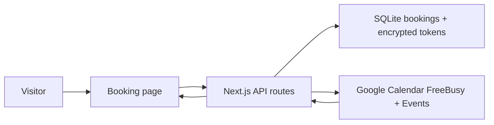

# Booking Link


A tiny self-hosted booking link for Google Calendar. It gives you a Calendly-style public booking page without syncing your whole calendar or running a multi-user SaaS.

## What It Does

- Shows a public booking page with a calendar-style date picker and time list.
- Reads busy time from Google Calendar with FreeBusy.
- Creates Google Calendar events with the invitee as an attendee.
- Stores encrypted owner OAuth tokens and local booking locks in SQLite.
- Supports tokenized cancellation links.

## How It Works



## Quick Start

1. Install dependencies.

```bash
npm install
```

2. Create local configuration.

```bash
cp env.example .env
npm run gen:key
```

Paste the generated key into `TOKEN_ENCRYPTION_KEY`. Then set:

- `OWNER_EMAIL`
- `OWNER_NAME`
- `GOOGLE_CLIENT_ID`
- `GOOGLE_CLIENT_SECRET`
- `ADMIN_SECRET`

3. Create a Google OAuth 2.0 Web application.

Use this authorized redirect URI:

```text
http://localhost:3000/api/admin/google/callback
```

Enable the Google Calendar API for the same Google Cloud project.

4. Start the app.

```bash
npm run dev
```

5. Connect Google Calendar.

Open `http://localhost:3000/admin`, enter `ADMIN_SECRET`, and complete the owner OAuth flow. Then share `http://localhost:3000`.

## Configuration

| Variable | Required | Description |
| --- | --- | --- |
| `APP_BASE_URL` | Yes | Public URL for callbacks and cancel links. |
| `OWNER_EMAIL` | Yes | Google account email expected during OAuth. |
| `OWNER_NAME` | No | Display name on the booking page. |
| `OWNER_TIME_ZONE` | Yes | IANA timezone used to generate availability. |
| `GOOGLE_CALENDAR_ID` | No | Calendar ID. Use `primary` for the authenticated primary calendar. |
| `GOOGLE_CLIENT_ID` | Yes | OAuth web client ID from Google Cloud. |
| `GOOGLE_CLIENT_SECRET` | Yes | OAuth web client secret from Google Cloud. |
| `TOKEN_ENCRYPTION_KEY` | Yes | 32-byte base64 key from `npm run gen:key`. |
| `ADMIN_SECRET` | Yes | Shared secret for `/admin` Google connection. |
| `EVENT_DURATION_MINUTES` | No | Meeting length. Defaults to `30`. |
| `SLOT_STEP_MINUTES` | No | Slot granularity. Defaults to the meeting length. |
| `BUFFER_MINUTES` | No | Busy-time padding around each meeting. |
| `BOOKING_WINDOW_DAYS` | No | How far ahead slots are shown. |
| `MINIMUM_NOTICE_MINUTES` | No | Minimum notice before a booking can start. |
| `AVAILABILITY_JSON` | No | JSON rules for weekly availability. |

Example availability:

```json
[
  { "days": [1, 2, 3, 4, 5], "start": "10:00", "end": "18:30" }
]
```

Luxon weekday numbers are Monday `1` through Sunday `7`.

## Security Notes

- Do not commit `.env`, Google OAuth client JSON files, or `data/*.db*`.
- Refresh tokens are encrypted at rest with `TOKEN_ENCRYPTION_KEY`.
- The app is designed for a single owner and single instance. Use a persistent disk if deploying with SQLite.
- If a secret was ever committed to a public repo, rotate it before rewriting history.

## Development

```bash
npm run typecheck
npm run build
```

## License

MIT
