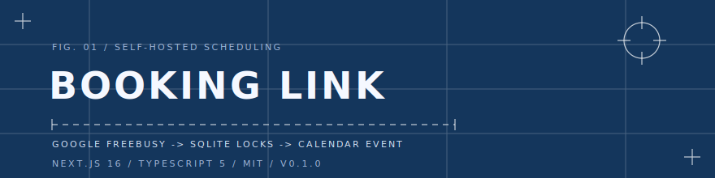
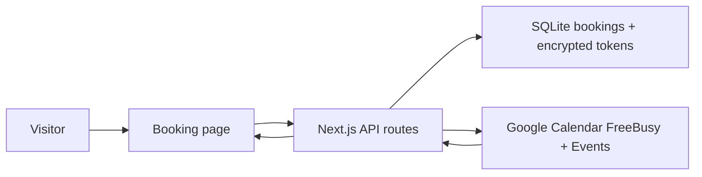

<div align="center">



# OpenMeet

一个可分享的预约页面。一个 Google Calendar 所有者。不需要团队排期、不需要账号系统，也不镜像整本日历。

<p>
  <a href="https://github.com/LaughingisLaughing/openmeet/actions/workflows/ci.yml"></a>
  <a href="https://github.com/LaughingisLaughing/openmeet/actions/workflows/secret-scan.yml"></a>
  <a href="https://github.com/LaughingisLaughing/openmeet/releases/tag/v0.1.0"></a>
  <a href="LICENSE"></a>
</p>

<p>
  
  
  
  
</p>

<a href="https://github.com/LaughingisLaughing/openmeet">
  
</a>

</div>

<p align="center"><a href="README.md">English</a> | 简体中文</p>

---

## 问题

你只是想分享一个预约链接，但很多排期工具会把这个简单的个人流程变成 SaaS 账号、团队排期模型，或者你并不需要的日历同步面。

OpenMeet 保持很小的产品表面：公开预约页、私有 owner 管理流程、Google Calendar 忙闲查询，以及本地 SQLite 锁。

## 解法

访客选择一个可用时间。应用会检查 Google Calendar FreeBusy，叠加本地预约锁，创建 Google Calendar 日程，并只保存本地预约状态和加密后的 owner OAuth token。



## 快速开始

OpenMeet 是一个应用，不是已发布的 npm 包。请从 GitHub 源码运行：

```bash
git clone https://github.com/LaughingisLaughing/openmeet.git
cd openmeet
npm install
cp env.example .env
npm run gen:key
npm run dev
```

把生成的 key 填入 `TOKEN_ENCRYPTION_KEY`，然后设置：

- `OWNER_EMAIL`
- `OWNER_NAME`
- `GOOGLE_CLIENT_ID`
- `GOOGLE_CLIENT_SECRET`
- `ADMIN_SECRET`

创建一个 Google OAuth 2.0 Web application，并添加这个 authorized redirect URI：

```text
http://localhost:3000/api/admin/google/callback
```

在同一个 Google Cloud project 中启用 Google Calendar API。然后打开 `http://localhost:3000/admin`

输入 `ADMIN_SECRET`，完成 owner OAuth 授权流程。

## 功能

| 能力 | 实现方式 |
| --- | --- |
| 公开预约页面 | 日历式日期选择器和可用时间列表 |
| 可用性检查 | Google Calendar FreeBusy 加本地 pending 和 confirmed 预约 |
| 日程创建 | Google Calendar event insert，并把访客作为 attendee |
| Token 存储 | owner OAuth token 使用 `TOKEN_ENCRYPTION_KEY` 静态加密 |
| 取消预约 | 基于本地预约状态的 tokenized cancellation link |

## 命令

| 命令 | 用途 |
| --- | --- |
| `npm run dev` | 启动本地开发服务器 |
| `npm run build` | 构建生产应用 |
| `npm run start` | 在构建后启动生产服务器 |
| `npm run typecheck` | 运行 TypeScript 检查，不输出文件 |
| `npm run gen:key` | 生成 32-byte base64 token encryption key |

## 配置

| 变量 | 必填 | 说明 |
| --- | --- | --- |
| `APP_BASE_URL` | 是 | 用于 callback 和 cancel link 的公开 URL。 |
| `OWNER_EMAIL` | 是 | OAuth 授权时期望匹配的 Google 账号邮箱。 |
| `OWNER_NAME` | 否 | 预约页面展示的名称。 |
| `OWNER_TIME_ZONE` | 是 | 用来生成可预约时间的 IANA timezone。 |
| `GOOGLE_CALENDAR_ID` | 否 | Calendar ID。已认证主日历可使用 `primary`。 |
| `GOOGLE_CLIENT_ID` | 是 | Google Cloud 中的 OAuth web client ID。 |
| `GOOGLE_CLIENT_SECRET` | 是 | Google Cloud 中的 OAuth web client secret。 |
| `TOKEN_ENCRYPTION_KEY` | 是 | 由 `npm run gen:key` 生成的 32-byte base64 key。 |
| `ADMIN_SECRET` | 是 | 用于 `/admin` Google 连接流程的共享密钥。 |
| `EVENT_DURATION_MINUTES` | 否 | 会议时长。默认 `30`。 |
| `SLOT_STEP_MINUTES` | 否 | 时间槽粒度。默认等于会议时长。 |
| `BUFFER_MINUTES` | 否 | 每个会议前后的 busy-time padding。 |
| `BOOKING_WINDOW_DAYS` | 否 | 展示未来多少天的可预约时间。 |
| `MINIMUM_NOTICE_MINUTES` | 否 | 预约开始前的最短提前量。 |
| `AVAILABILITY_JSON` | 否 | 每周可预约规则的 JSON。 |

<details>
<summary>Availability JSON 示例</summary>

```json
[
  { "days": [1, 2, 3, 4, 5], "start": "10:00", "end": "18:30" }
]
```

Luxon weekday number 从周一 `1` 到周日 `7`。

</details>

## 部署说明

- 生产环境连接 Google OAuth 前，把 `APP_BASE_URL` 设置为公开 URL。
- 在同一个 Google OAuth web client 中添加生产 callback URL，例如 `https://your-domain.example/api/admin/google/callback`
- 为 SQLite 挂载持久化磁盘，或把 `DATABASE_PATH` 设置到持久化路径。
- 每个数据库文件只运行一个实例，这样预约锁才可靠。

## 安全说明

- 不要提交 `.env`、Google OAuth client JSON 文件或 `data/*.db*`。
- Refresh token 使用 `TOKEN_ENCRYPTION_KEY` 静态加密。
- 这个应用面向单 owner 和单实例运行。
- 如果 secret 曾经被提交到公开仓库，请先 rotate，再重写历史。

## 项目文档

- [架构](docs/architecture.md)
- [实现蓝图](docs/blueprint.md)
- [API contract](contracts/api.yaml)
- [Changelog](CHANGELOG.md)
- [Security policy](SECURITY.md)
- [Contributing](CONTRIBUTING.md)

## Star History

<div align="center">
  <a href="https://star-history.com/#LaughingisLaughing/openmeet&Date">
    
  </a>
</div>

## License

MIT，见 [LICENSE](LICENSE)。
